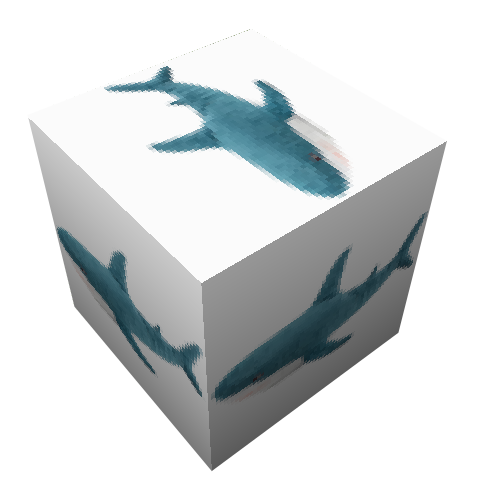

<h1 align="center">
     
	hajpack
</h1>

    a tech and exploration modpack with no gimmicks

## Mod List
> 📝 **TODO:** Add mods

## About
hajpack was started by users from the Arch Linux community server who were looking to make a modded server, however most of the modpacks had too many gimmicks. hajpacks point is just to be simple and fun, with no gimmicks.

Originally it was planned to be specifically for the server, however it was decided to also make it public for anyone to use.

<h2 align="center">Developers</h2>

<table class="tg">
<tbody>
  <tr>
    <th class="tg-0pky"></th>
    <th class="tg-0pky"> </th>
    <th class="tg-0pky"></th>
    <th class="tg-0pky"></th>
  </tr>
  <tr>
    <td class="tg-0pky"><a herf="https://github.com/electron271">electron271</a></td>
    <td class="tg-0pky"><a herf="https://github.com/RPMYT">Lilirine</a></td>
    <td class="tg-0pky"><a herf="https://github.com/altqther">Qther</a></td>
    <td class="tg-0pky"><a herf="https://github.com/armv8-a">armv8</a></td>
  </tr>
  <tr>
    <td class="tg-0pky"></td>
    <td class="tg-0pky"></td>
    <td class="tg-0pky"></td>
    <td class="tg-0pky"></td>
  </tr>
  <tr>
    <td class="tg-0pky"><a herf="https://github.com/gaussandhisgun">Gravitos</a></td>
    <td class="tg-0pky"><a herf="https://github.com/walksanator">walksanator</a></td>
    <td class="tg-0pky"><a herf="https://github.com/exhq">exhq</a></td>
    <td class="tg-0pky"><a herf="https://github.com/nixos-goddess">Nixos Goddess</a></td></td>
  </tr>
</tbody>
</table>

                  
